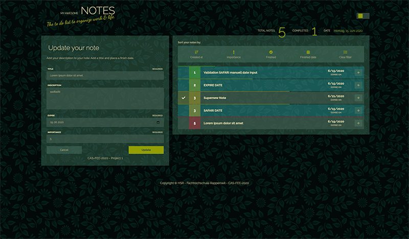
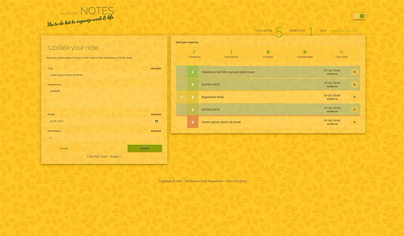

<!-- PROJECT LOGO -->
<h1 align="center">CAS-FEE-2020 Project I</h1>
<p align="center">
  
</p>

<!-- GETTING STARTED -->
## Overview

This application can manage your notes. Add new notes, set an expiration date and a priority. Your daily tasks are marked, so you never lose track of your daily to-dos. 

Sorting is supported by creation date, finished date, priority or simply list your completed tasks in ascending or descending order. You can run it locally and access it with your preferred Browser (see support list below).

<p align="center">
  
</p>

## Features
* CRUD operations - add, read, edit and delete notes.
* Notes due today are hightlighted.
* Theme toggler - Switch theme between dark and bright colors.

## Sort notes by different criteria
* by creation date
* creation date
* priority
* completion date

<p align="center">
  
</p>

## Installation
### Prerequisites

Mongodb and Node.js are needed locally. The installation of these components is not covered by this documentation. Follow the instructions on the official websites of these components. So let's get started and take notes!

1. Clone the repo
```sh
git clone https://github.com/webrooster/CAS_Projekt1.git
```

2. Change into the directory
```sh
cd CAS_Projekt1
```

3. Install NPM packages
```sh
npm install
```

4. Start your local MongoDB
```sh
mongod-start
```

5. Start the application
```sh
npm start
```

6. Visit your browser and type
```sh
localhost:3000
```

## Versioning
```sh
Node Version: v12.14.0
NPM Version: 6.13.4
MongoDB Version: 4.2 Community Edition
```

## Browser Support
* Firefox Quantum - Version 68.4.1esr (64-bit)
* Google Chrome - Version 83.0.4103.97 (Official Build) (64-bit)
* Safari - Version 13.1.1 (15609.2.9.1.2)
* Windows Edge Browser (latest)

## Known Issues
* No date picker support on Safari Browsers.

## Author
Roland von Aesch